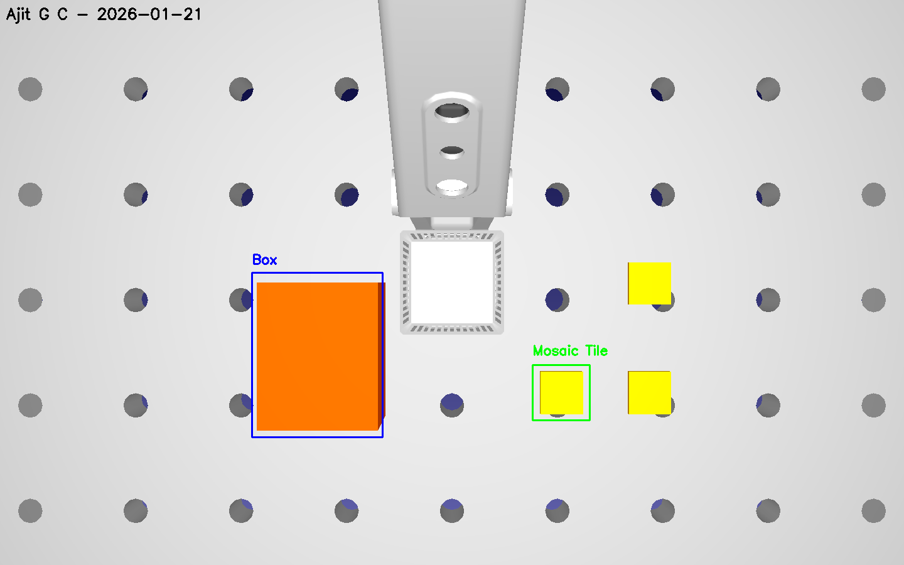

# Machine Vision – Week 1 Lab Report

## Student Information
- **Name:** Ajit G C
- **Course:** Machine Vision
- **Week:** 1
- **Institution:** HAMK – Häme University of Applied Sciences

---

## 1. Introduction

This lab focuses on the basic setup and usage of OpenCV together with a simulated camera in RoboDK.  
The objective is to understand image input/output, color channels, and basic image annotation, as well as how a simulated robotic camera can be integrated into a vision pipeline.

The lab is divided into two parts:
- Part A: OpenCV basics using a standard RGB image
- Part B: RoboDK camera snapshot processing and annotation using OpenCV

---

## 2. Part A – OpenCV Basics

### 2.1 Description

In Part A, a colorful RGB image was loaded using OpenCV.  
The image was converted from BGR to RGB format and split into its Red, Green, and Blue channels.  
The original image and the three channels were displayed together in a 2×2 grid and saved as an image file.

This task helped in understanding how color images are represented as multi-channel matrices in OpenCV.

---

### 2.2 Results (Task A)

📌 **INSERT YOUR SCREENSHOT HERE**

👉 Place **ONE image** that shows:
- Original image
- Red channel
- Green channel
- Blue channel

**(This is the image saved by `task-a.py`, e.g. `task_a_channels_grid.png`)**

Example caption:
[Original RGB Image](images/colourimg.jpg)

[RGB Channels](images/task-a-result.jpg)
> *Figure 1: Original RGB image and its Red, Green, and Blue channels.*

---

## 3. Part B – RoboDK + OpenCV

### 3.1 RoboDK Camera Setup

A RoboDK station containing a Dobot MG400 robot and multiple objects on a table was used.  
A reference frame named `CameraFrame` was added, and a simulated 2D camera was attached to it.  
The camera resolution was set to 640 × 480 pixels, and multiple objects were placed within the camera’s field of view.

A snapshot was captured programmatically using the RoboDK Python API and saved for further processing.

---

### 3.2 Image Annotation (Task B2)

The RoboDK camera snapshot was loaded into OpenCV.  
The image dimensions (height, width, and channels) were printed to verify correct loading.

Two objects on the table were manually annotated using OpenCV drawing functions:
- Rectangles were drawn around selected objects
- Object names were added as text labels
- The student name and date were written at the top of the image

All annotation coordinates were selected manually by visually inspecting the image, as object detection was not automated in this assignment.

---

### 3.3 Results (Task B2)

**(This is the image saved by `task-b2.py`, e.g. `robodk_annotated.png`)**

Example caption:
[RoboDK Snapshot](images/robodk_snapshot.png)

---

## 4. Discussion and Findings

The tasks in this lab were relatively straightforward once the development environment was properly configured.  
The OpenCV image operations were fast and intuitive, especially for loading images, splitting channels, and drawing annotations.

Some challenges were encountered during the RoboDK Python integration, particularly related to Python configuration on macOS.  
However, once the correct setup was established, capturing camera snapshots programmatically was reliable and efficient.

This lab demonstrates how simulation tools such as RoboDK can be effectively combined with OpenCV for developing and testing vision-based robotic systems.

---

## 5. Conclusion

This lab successfully demonstrated the fundamentals of machine vision using OpenCV and RoboDK.  
The results provide a solid foundation for more advanced tasks such as camera calibration, object detection, and robot-guided vision in future assignments.
